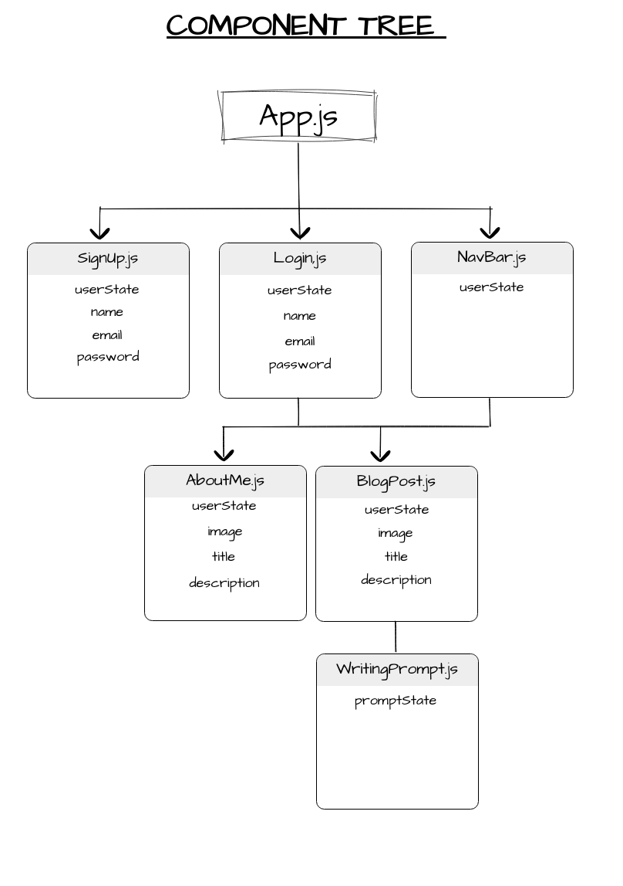

# TheBlogology-Backend

---
## Overview
The Blogology is type of website that is updated regularly with new content. It would be a personal space or place for the author on the internet. The website itself offers a writing prompt generator for it users if they ever wnated to be creative. 

---
## ERD

---
## Component Tree

---
## Wireframe

---
## User Stories 
* User would be able to create an account with the following name,email, and password.
* User would login with their email and password. Then it would send to the user home-page.
* On the home-page user is able to generate a writing prompt, write the prompt, and edit their about me. 
* User could also be able to see previous writing prompts. 
* User could also post photos of their own. 

---
## Routes
| PATH | ROUTE | Description |
| --- | --- | --- |
| /user | POST | Signup/Create user |
| /user/login | POST | Login user |
| /user | GET | Verify user |
| /prompts | GET | Generates writing prompts|
| /prompts | GET | Pull Previous prompts|
| /prompts | POST| Post prompts & discription |
| /prompts | DELETE | Remove prompts|
| /photos | POST | upload photos|
| /photos | DELETE| removes|
| /profiles | GET | Show user information|
## Core Goal

---

* Create User
* Sign-up & Sign-in
* Be able to show account information
* Be able to Pull, display, and reaload writing prompt api
* Add, Show, & Delete events

---

## Strech Goal
* Password hashing and account information encryption
* Be able to updates account information